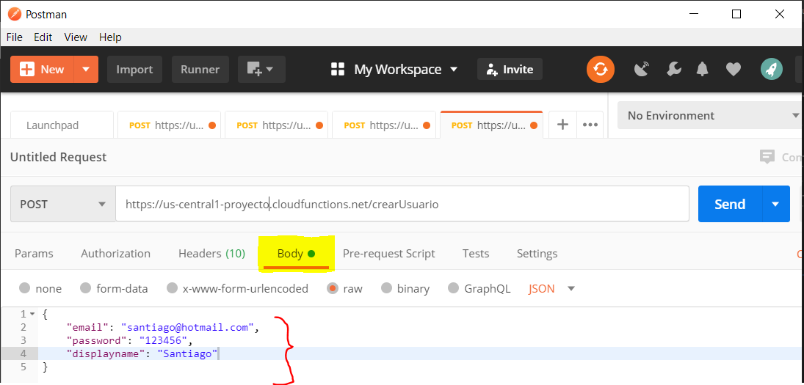

# cloud-functions-firebase
Ejemplos de crear una cloud function en firebas

Quiero agradecerles por ver este tutorial sobre cloud functions en firebase.

## ¿Qué son las cloud functions ?
Las clouds functions son funciones que se ejecutan como código del lado del servidor sin neceesidad que tengamos que configurar un servidor para algún lenguaje.

## Pasos para crear una cloud function
### Crear un proyecto en firebase
### Instalación
1. Deberá instalar Node.js y npm

2. Instalar firebase CLI:

    ```
    npm install -g firebase-tools
    ```
    Si le sale error al momento de instalar pueda que no este actualizado para ese caso ingrese la siguiente línea: 
    ```
    npm cache clean --force
    npm i -g firebase-tools
    ```
    Iniciamos sesión con firebase 
    ```
    firebase login
    ```
    Creamos
    ```
    firebase init
    ```
    ingresamos *yes* para proceder
    ```
    ? Are you ready to proceed? Yes
    ```
    Escogemos la opción functions 
    ```
        ? Which Firebase CLI features do you want to set up for this folder? Press Space to select features, then Enter to confirm your choices. (Press <space> to select, <a> to toggle all, <i> to invert
        selection)
        [] Database: Deploy Firebase Realtime Database Rules
        [] Firestore: Deploy rules and create indexes for Firestore
        [x] Functions: Configure and deploy Cloud Functions
        [] Hosting: Configure and deploy Firebase Hosting sites
        [] Storage: Deploy Cloud Storage security rules
        [] Emulators: Set up local emulators for Firebase features
    ```
    ```
        ? Please select an option:
         > Use an existing project
        Create a new project
        Add Firebase to an existing Google Cloud Platform project
        Don't set up a default project
    ```
    Seleccionamos el proyecto  que vamos a instalar
    
    ```
    ? What language would you like to use to write Cloud Functions? (Use arrow keys)
    > JavaScript
    TypeScript
    ```
    Después seleccionamos yes
    ```
    ? Do you want to use ESLint to catch probable bugs and enforce style? Yes
    ```
    Damos yes a las dependencias de npm
    ```
    ? Do you want to install dependencies with npm now? Yes
    ```


2. Crear cloud functions

Después que hemos terminado de instalar las dependencias, abrimos la carpeta functions: 
```
cd .\functions
```
En la carpeta functions encontraremos un index.js, en ese archivo pondremos las funciones cloud functions

3. Example:

    El siguiente código hace la función de crear usuarios en el authentication,  mediante el método POST:

    ```js
    const functions = require("firebase-functions");
    const admin = require("firebase-admin");
    admin.initializeApp(functions.config().firebase);
    exports.crearUsuario = functions.https.onRequest((request, response) => {
    response.header("Content-Type", "application/json");
    response.header("Access-Control-Allow-Origin", "*");
    response.header("Access-Control-Allow-Headers", "Content-Type");

    if (request.method === "OPTIONS") {
        return response.status(204).send("");
    }
    if (request.method === "GET") {
        return response.status(404).send("Not founf method get");
    } else if (request.method === "POST") {
        return admin
        .auth()
        .createUser(request.body)
        .then((userRecord) => {
            return response.status(202).json({
            message: "create successfully",
            data: userRecord,
            });
        })
        .catch((error) => {
            console.log("Error de cloud ", error);
            return response.status(500).send(error);
        });
    }
    });
    ```
    Después de insertar el código pasaremos a deployarlo: 
    ```
    firebase deploy --only functions
    ```
    terminando la ejecución nos dará la *url function*
    por ejemplo: 
    ```
    https://us-central1-proyecto.cloudfunctions.net/crearUsuario
    ```
    Para poder probar el servicio podemos utilizar el postman

    [Descargar postman.](https://www.postman.com/)

    Después de la instalación hacemos lo siguiente: 
    
        1) Seleccionamos el método POST en Postman
        2) Agregamos la url function
        3) Vamos a la pestaña headers:
            a) agregamos como key: Content-Type y value: application/json

    

    Después vamos a la pestaña Body y ingresamos el json para crear un nuevo usuario con el authentication
    

    Para finalizar le damos en **Send**


    Gracias por leer este git.